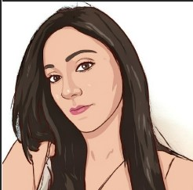
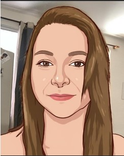
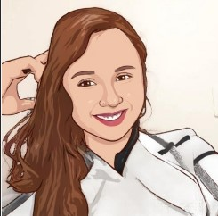

# Especificações do Projeto

A definição do problema e os pontos mais relevantes a serem tratados neste projeto foram consolidados com a participação de clientes da loja **Permita-se** a partir de conversas e entrevistas. Os detalhes levantados nesse processo foram agrupados na forma de personas e histórias de usuários.

## Personas

As personas levantadas durante o processo de entendimento do problema são apresentadas na Figuras que se seguem. 

| **Bianca Souza** |      |      |
|------------------------------|------|------|
| | **Idade:** 40 anos  | **Ocupação:** Terapeuta Holística, Massoterapeuta e socia da loja Permita-se que atua como fornecedora dos produtos artesanais. Empreendedora. |
| **Motivações:** Bianca Souza é motivada pela necessidade de aprendizado através de cursos, por trabalhos artesanais e pela família	| **Frustrações:** -- | **Hobbies, História:** Estudar, levar uma vida saudável aos clientes, viajar|

| **Iza Souza** |      |      |
|------------------------------|------|------|
| | **Idade:** 34 anos  | **Ocupação:** Técnica de laboratório e socia da loja Permita-se que atua como vendedora dos produtos. Empreendedora. |
| **Motivações:** Iza Souza é movida pelo crescimento profissional e pelo amor aos familares.	| **Frustrações:** -- | **Hobbies, História:** Viajar, leitura e assistir series/filmes|

| **Fernanda Mendes** |      |      |
|------------------------------|------|------|
| | **Idade:** 27 anos  | **Ocupação:** Biomédica, empreendedora e cliente da loja Permita-se |
| **Motivações:** Fernanda encontra motivação no amor a família e pelos estudos.	| **Frustrações:** -- | **Hobbies, História:** passeios com os amigos, viagens.|

## Histórias de Usuários

Com base na análise das personas forma identificadas as seguintes histórias de usuários:
|EU COMO... `PERSONA`| QUERO/PRECISO ... `FUNCIONALIDADE` |PARA ... `MOTIVO/VALOR`                 |
|--------------------|------------------------------------|----------------------------------------|
|Bianca Souza        | Deseja uma plataforma onde consiga postar os seus produtos, com fotos e todas as especificações de cada um. | Para facilitar na divulgação dos seus produtos. |
|Iza Souza           | Deseja uma plataforma onde consiga filtrar e ordenar seus produtos. | Para direcionar a venda com o produto correto para cada cliente. |
|Fernanda Mendes     |Deseja uma plataforma de venda onde ela como cliente tenha ajuda de como escolher o produto específico para ela.| Para auxiliar a escolher o melhor produto de acordo com seu perfil. |
|Julia Freitas       | Deseja um canal de comunicação de fácil acesso com os vendedores da loja através do catálogo de vendas. | Para agilizar o processo de compra e tirar dúvidas caso seja necessário. |
|Marcela Amorim      | Deseja localizar em uma página todas as informações necessárias para a escolha do seu produto. | Para não se perder entre as páginas e ter agilidade na compra.  |
|Lorena Marques      | Deseja uma plataforma de venda onde ela possa salvar os produtos escolhido. | Para finalizar a compra depois caso não deseje finalizar naquele momento. |
|Tomas Magno         | Deseja ter acesso a informações sobre o produto de forma clara e acessível.| Para conhecer melhor a marca e os produtos ofertados. |

## Requisitos

As tabelas que se seguem apresentam os requisitos funcionais e não funcionais que detalham o escopo do projeto.

### Requisitos Funcionais

|ID    | Descrição do Requisito  | Prioridade |
|------|-----------------------------------------|----|
|RF-001| Permitir que o usuário cadastre tarefas | ALTA | 
|RF-002| Emitir um relatório de tarefas no mês   | MÉDIA |

### Requisitos não Funcionais

|ID     | Descrição do Requisito  |Prioridade |
|-------|-------------------------|----|
|RNF-001| O sistema deve ser responsivo para rodar em um dispositivos móvel | MÉDIA | 
|RNF-002| Deve processar requisições do usuário em no máximo 3s |  BAIXA | 

Com base nas Histórias de Usuário, enumere os requisitos da sua solução. Classifique esses requisitos em dois grupos:

- [Requisitos Funcionais
 (RF)](https://pt.wikipedia.org/wiki/Requisito_funcional):
 correspondem a uma funcionalidade que deve estar presente na
  plataforma (ex: cadastro de usuário).
- [Requisitos Não Funcionais
  (RNF)](https://pt.wikipedia.org/wiki/Requisito_n%C3%A3o_funcional):
  correspondem a uma característica técnica, seja de usabilidade,
  desempenho, confiabilidade, segurança ou outro (ex: suporte a
  dispositivos iOS e Android).
Lembre-se que cada requisito deve corresponder à uma e somente uma
característica alvo da sua solução. Além disso, certifique-se de que
todos os aspectos capturados nas Histórias de Usuário foram cobertos.

## Restrições

O projeto está restrito pelos itens apresentados na tabela a seguir.

|ID| Restrição                                             |
|--|-------------------------------------------------------|
|01| O projeto deverá ser entregue até o final do semestre |
|02| Não pode ser desenvolvido um módulo de backend        |

Enumere as restrições à sua solução. Lembre-se de que as restrições geralmente limitam a solução candidata.

> **Links Úteis**:
> - [O que são Requisitos Funcionais e Requisitos Não Funcionais?](https://codificar.com.br/requisitos-funcionais-nao-funcionais/)
> - [O que são requisitos funcionais e requisitos não funcionais?](https://analisederequisitos.com.br/requisitos-funcionais-e-requisitos-nao-funcionais-o-que-sao/)

## Diagrama de Casos de Uso

O objetivo do diagrama de caso de uso em UML é demonstrar as diferentes maneiras que um usuário pode interagir com o sistema. Para o nosso caso, teremos apenas dois usuários: Cliente e Gerente, e no diagrama abaixo, podemos visualizar as funcionalidades acessadas por cada um.

